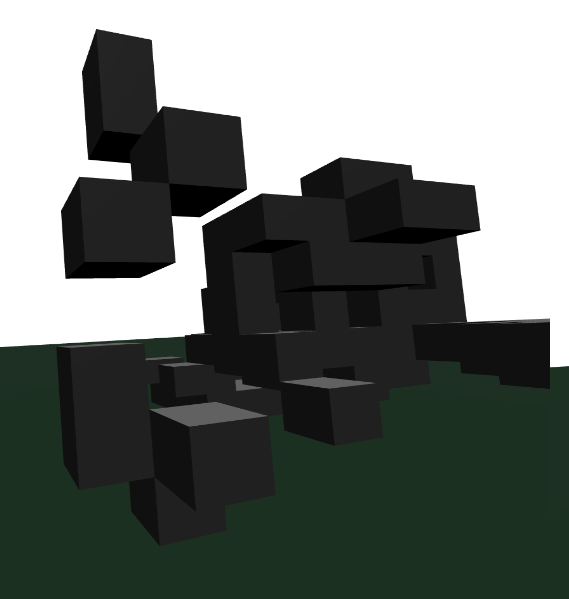

# Super simple Minecraft in VR for the HTC Vive

This 4-steps tutorial allows you to create a simple VR Minecraft application for the HTC Vive with A-frame.

Refer to the index.html file in this project for the final result.

To run it, serve the index.html page with a http server (e.g. [http-sever](https://www.npmjs.com/package/http-server)), load it to a webvr-enabled browser (see http://webvr.info) and interact with the app using your HTC Vive headset and controllers.

Here is a screenshot of what a user can create with this app:


The trigger button is used to create a block and the grip button to delete one.

Enough talking, let's get started:

## Step 1: Basic HTML page setup

Create your HTML doc and include the [a-frame](https://aframe.io) library.

```
<!DOCTYPE html>
<html>
  <head>
    <meta charset="utf-8">
    <title>Simple Minecraft in VR with A-frame</title>
    <script src="https://aframe.io/releases/0.5.0/aframe.min.js"></script>
  </head>
  <body>
     ...
  </body>
</html>
```

## Step 2: Basic A-frame setup

Create the A-frame scene by adding a `<a-scene>` tag (with the id `myscene` to `<body>`.

```
<body>
  <a-scene id="myscene">
    <a-plane height="100" width="100" rotation="-90 0 0" color="#243e2c"></a-plane>

    <a-light type="directional" position="-0.5 3 1" intensity="0.8"></a-light>

    <a-entity vive-controls="hand: left"></a-entity>
    <a-entity vive-controls="hand: right"></a-entity>
  </a-scene>
</body>
```

To the scene, we add:
* a large flat dark green plane to represent the earth
  ```
  <a-plane height="100" width="100" rotation="-90 0 0" color="#243e2c"></a-plane>
  ```
* a directional light to create shadows
  ```
  <a-light type="directional" position="-0.5 3 1" intensity="0.8"></a-light>
  ```
* finaly 2 objects for the HTC Vive controllers
  ```
  <a-entity vive-controls="hand: left"></a-entity>
  <a-entity vive-controls="hand: right"></a-entity>
  ```

## Step 3: Add a block

To add a block, we add a `<script>` tag to the `<body>` and then a 'addBox()' method that we invoke when any of the controllers' trigger is pressed.

The position of a block is aligned to a virtual grid every 10th of unit with the `align()` method.

```
<script>
  function align(pos) {
    return Math.floor(pos * 10) / 10;
  }

  function addBlock(position) {
    var block = document.createElement("a-box");
    block.setAttribute('width', '0.1');
    block.setAttribute('height', '0.1');
    block.setAttribute('depth', '0.1');
    block.setAttribute('color', '#808080');
    block.setAttribute('position', align(position.x) + ' ' + align(position.y) + ' ' + align(position.z));
    document.getElementById('myscene').appendChild(block);
  }

  document.querySelectorAll('a-entity[vive-controls]').forEach(function (elem) {
      elem.addEventListener('triggerdown', function(e) {
        addBlock(e.srcElement.getAttribute('position'));
      });
  });
</script>
```

## Step 4: Delete a block

To remove a block that was added earlier, we add a 'delBox()' method that we invoke when any of the controllers' trigger is pressed.


```
function delBox(position) {
  document.querySelectorAll('a-box').forEach(function (elem) {
    var elemPos = elem.getAttribute('position');
    if (elemPos.x === align(position.x) &&
        elemPos.y === align(position.y) &&
        elemPos.z === align(position.z)) {
      document.getElementById('myscene').removeChild(elem);
    }
  });
}

document.querySelectorAll('a-entity[vive-controls]').forEach(function (elem) {
    ...

    elem.addEventListener('gripdown', function(e) {
      delBlock(e.srcElement.getAttribute('position'));
    });
});
```
